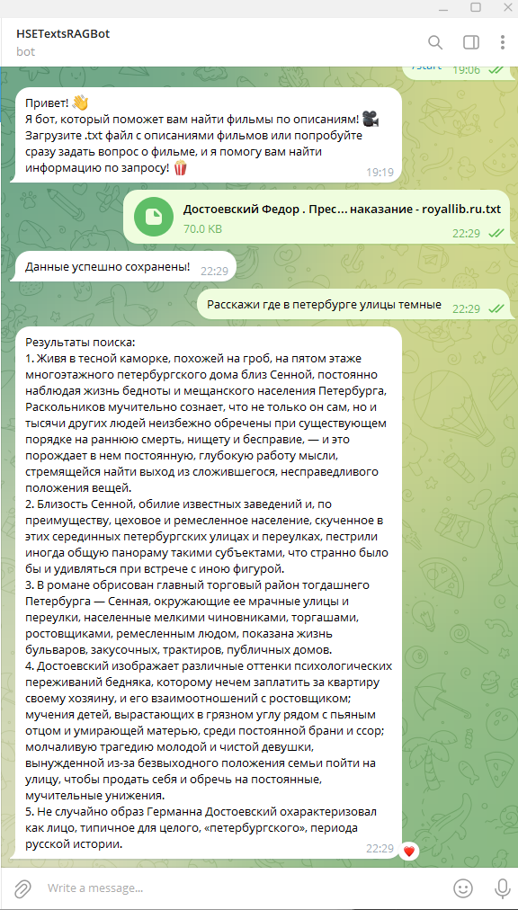

# Retrieval-Augmented Generation (RAG) Chat Bot

Финальный проект. Необходимо разработать чат-бота, который использует Retrieval-Augmented Generation (RAG) для работы с пользовательскими документами. Бот применяет векторную базу данных (например, ChromaDB) для поиска релевантных данных, опознает сущности в текстах и выдает рекомендации, связанные с содержанием документов.

Этот проект базируется на Movie Recommendation Bot, который является Telegram-ботом, предлагающим фильмы на основе описаний. Он анализирует пользовательские запросы и сопоставляет их с описаниями, чтобы найти релевантные рекомендации. 

---

## Системные требования

- Python версии 3.8 или выше
- Установленные Docker и Docker Compose

---

## Установка

### 1. Клонирование репозитория

```bash
git clone https://github.com/Strelker/HSEtextsBotRag
cd HSEtextsBotRag
```

### 2. Установка зависимостей

Для локального запуска выполните команду:

```bash
pip install -r src/requirements.txt
python3 -m spacy download en_core_web_sm
```

При использовании Docker все зависимости устанавливаются автоматически во время сборки контейнера.

---

## Конфигурация

Перед запуском бота необходимо указать токен вашего Telegram-бота:

1. **`BOT_TOKEN`**: Уникальный токен, предоставляемый Telegram.

Добавьте этот токен в файл `.env`, который приложение будет использовать для работы.

Пример `.env` файла:

```
BOT_TOKEN=ваш_токен_бота
```

---

## Запуск через Docker

1. Запустите проект с помощью Docker Compose:

```bash
docker-compose up --build
```

Эта команда создаст и запустит необходимые контейнеры, готовые к использованию.

---

## Запуск без Docker

1. Настройте окружение, загрузите базу данных и запустите приложение:

```bash
source .env
cd src
python3 app.py
```

---

## Описание компонентов

- **`docker-compose.yml`**: Настройки для контейнеров Docker, включая конфигурацию приложения и зависимостей.
- **`Dockerfile`**: Шаги для создания Docker-образа с интеграцией всех необходимых библиотек.
- **`scripts/run.sh`**: Удобный скрипт для запуска приложения, особенно в изолированных средах.
- **`src/app.py`**: Основной скрипт, который содержит логику обработки запросов пользователей, поиска данных и отправки результатов.
- **`src/requirements.txt`**: Список Python-библиотек, необходимых для работы проекта.

---

## Важные моменты

1. Перед запуском убедитесь, что переменная `BOT_TOKEN` настроена корректно.
2. Если возникают ошибки при работе с Telegram API, проверьте доступность токена и сетевые настройки.

---

## Пример использования

Тестовый бот доступен по ссылке: [@hsetextsragbot](https://t.me/hsetextsragbot)

